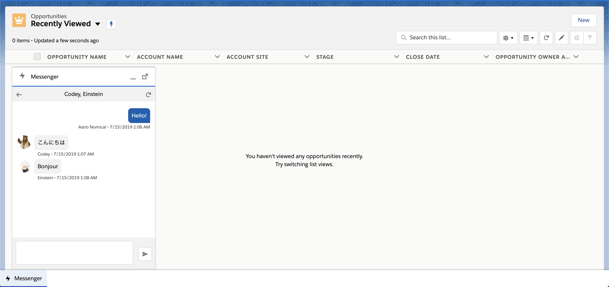
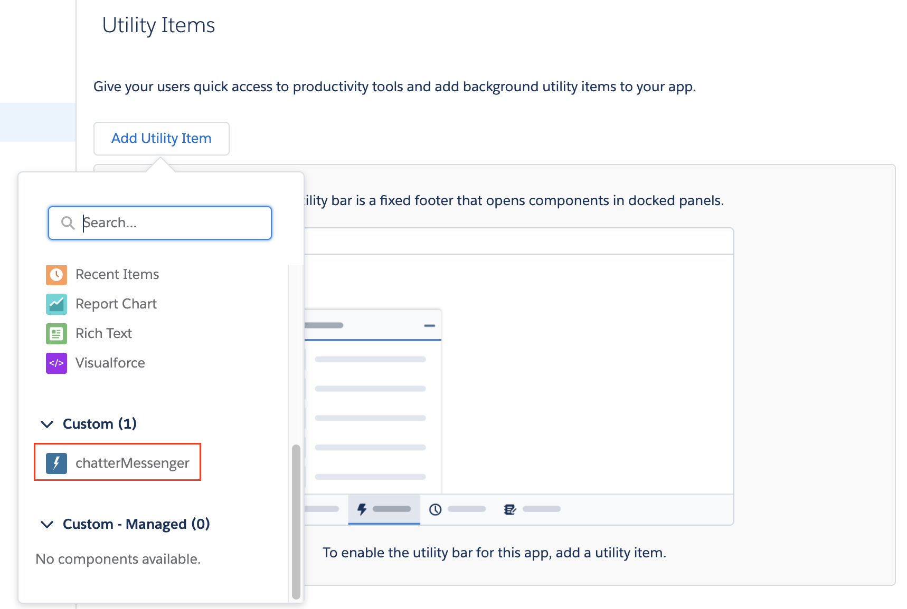

# Lightning Chatter Messenger
⚡Chatter messenger utility item, which supports private chatter conversation, in Salesforce Lightning Experience. Built by Lightning Web Component.

## 📦 Installation
Click the following link. Before installation, my domain must be enabled in the target org.
* [Install to Production/DE](https://login.salesforce.com/packaging/installPackage.apexp?p0=04t3i000000Rqs5
)
* [Install to Sandbox](https://test.salesforce.com/packaging/installPackage.apexp?p0=04t3i000000Rqs5)

You can also install in your scratch org by cloning this repo and pushing the source. 

After installation, add `chatterMessenger` custom component as an utility item in application setting.

## ✋ Feedback/Contributing
Feature requests, bug reports and pull requests are welcome🙏🏻

## 🎉 Special Thanks
* [Akira Kuratani](https://www.twitter.com/a_kuratani/) - This project is inspired by his [LightningMessage](https://www.github.com/kuratani/LightningMessage/) app.

## 👀 License
The source code is licensed under the [MIT license](./LICENSE)